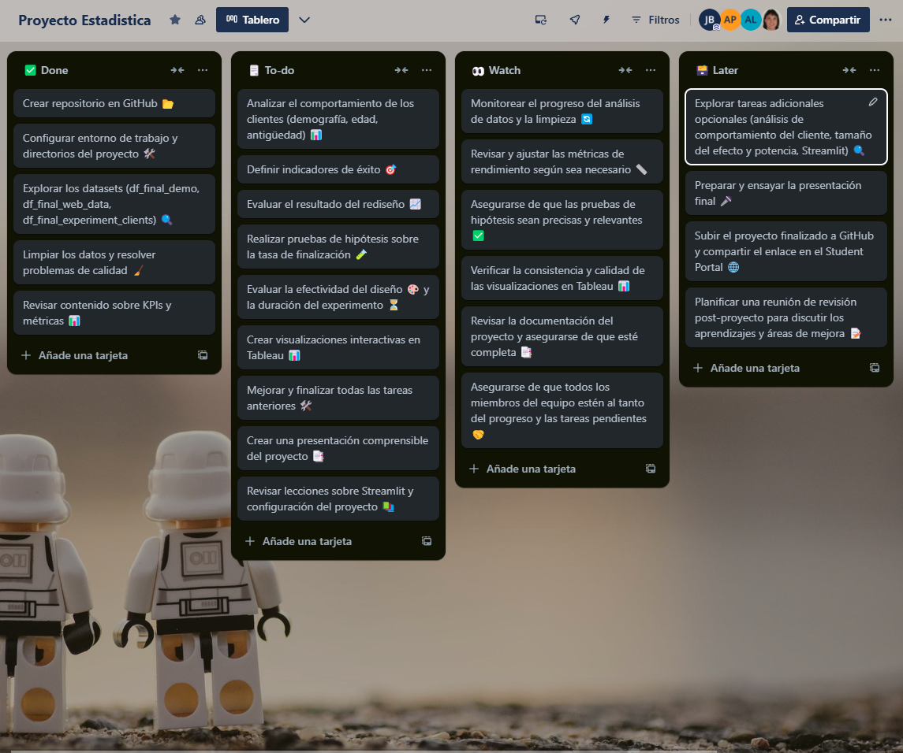
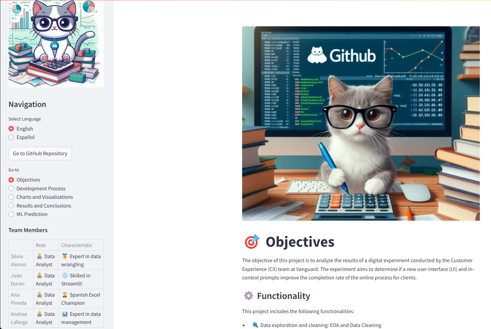
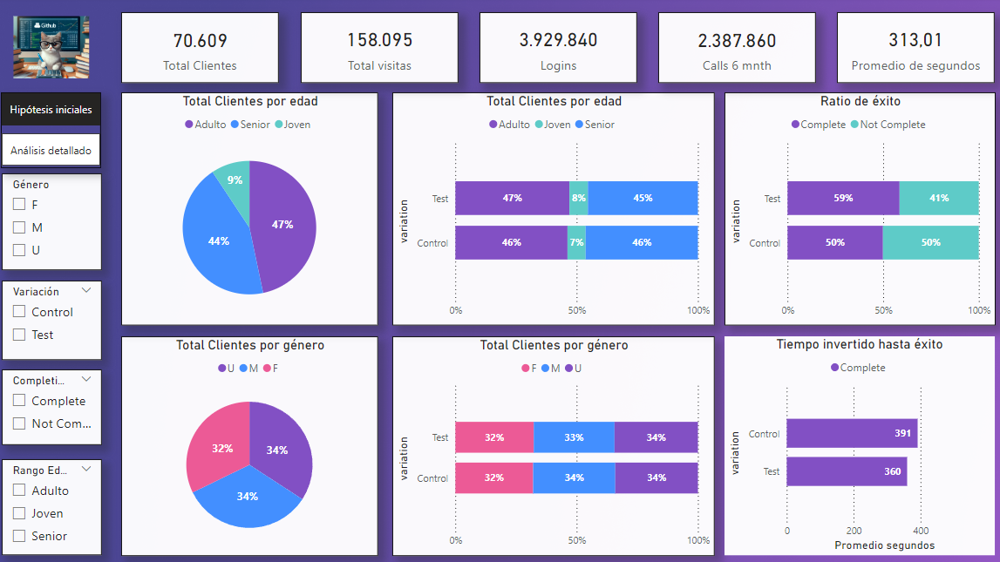
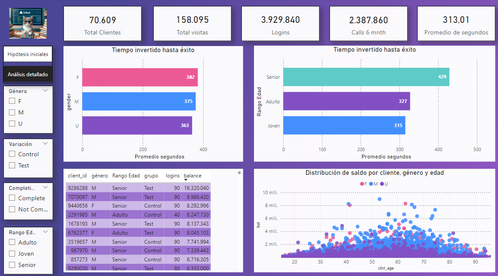

# 📊 Statistics-project

## 🎯 Objectives

The objective of this project is to analyze the results of a digital experiment conducted by the Customer Experience (CX) team at Vanguard. The experiment aims to determine if a new user interface (UI) and in-context prompts improve the completion rate of the online process for clients.

## ⚙️ Functionality

This project includes the following functionalities:

- **🔍 Data exploration and cleaning**: EDA and Data Cleaning
- **📊 Client behavior analysis**
- **📈 Performance metrics evaluation**
- **🧪 Hypothesis testing**: Assess the effectiveness of the redesign
- **🔬 Experiment evaluation**
- **📉 Interactive data visualization**: Using Tableau

## 🛠️ Tools Used

The following tools and technologies were used to carry out this project:

- **🐍 Python**: For data exploration and analysis
- **📊 Pandas**: For data manipulation and cleaning
- **📉 Matplotlib and Seaborn**: For data visualization
- **📊 Tableau**: For creating interactive visualizations
- **📓 Jupyter Notebook**: For documenting and presenting the analysis
- **🐙 GitHub**: For version control and collaboration
- **📋 Trello**: For project management
- **🌐 Streamlit**: For building and deploying the interactive web application
- **🤖 Scikit-learn**: For implementing the Machine Learning model

## 🚀 Development Process

### 🧹 Data Exploration and Cleaning:

- Initial exploration of the datasets (`df_final_demo`, `df_final_web_data`, `df_final_experiment_clients`).
- Data cleaning and resolving quality issues.

### 📊 Client Behavior Analysis:

- Demographic analysis of clients.
- Analysis of client behavior during the online process.

### 📈 Performance Metrics Evaluation:

- Defining success indicators.
- Evaluating the outcome of the redesign.

### 🧪 Hypothesis Testing:

- Conducting hypothesis tests on the completion rate.
- Evaluating the completion rate with a cost-effectiveness threshold.
- Conducting other relevant hypothesis tests.

### 🔬 Experiment Evaluation:

- Evaluating the design effectiveness.
- Assessing the duration of the experiment.
- Identifying additional data needs.

### 📉 Data Visualization with Tableau:

- Creating interactive visualizations in Tableau.
- Preparing dashboards for the presentation.

## 📈 Results

The project results include:

- A detailed analysis of client behavior and the effectiveness of the redesign.
- Hypothesis tests supporting conclusions about the completion rate.
- Interactive visualizations in Tableau presenting the findings clearly and comprehensively.
- A final report and presentation summarizing the results and recommendations.

## 📄 Summary Report

## 📋 Trello Board

Our Trello board is an essential tool for managing the project's workflow and ensuring that all tasks are organized and tracked efficiently. It helps us to:

- **Plan**: Outline the project's objectives, milestones, and deliverables.
- **Organize**: Break down the project into manageable tasks and assign them to team members.
- **Track Progress**: Monitor the status of each task, from to-do to in-progress to completed.
- **Collaborate**: Facilitate communication and collaboration among team members by providing a centralized platform for updates and feedback.
- **Adapt**: Adjust plans and priorities as needed based on the project's progress and any new insights or challenges that arise.

Here is a snapshot of our Trello board:

## 🗂️ Project Structure

The project is organized as follows:

- **📂 analysis_of_clients/**: Contains scripts and notebooks for client behavior analysis.
- **🧹 cleaning/**: Contains scripts for data cleaning and preprocessing.
- **🖼️ images/**: Directory for storing image files used in the project.
- **🤖 machine_learning/**: Contains scripts and notebooks for machine learning models.
- **📊 powerbi/**: Contains PowerBI files and reports.
- **🌐 streamlit_app/**: Contains the main Streamlit application and related assets.
  - **app.py**: The main application script.
  - **🎥 videos/**: Directory for storing video files used in the app.
  - **📂 data/**: Directory for storing data files used in the app.
- **📉 visualization/**: Contains scripts and notebooks for data visualization.
- **🚫 .gitignore**: Specifies files and directories to be ignored by Git.
- **📜 LICENSE**: The project license file.
- **📄 README.md**: The project documentation file.
- **📋 requirements.txt**: Lists the Python dependencies required for the project.

## 🌐 Streamlit App

The Streamlit app provides an interactive interface for users to explore the project's results and make predictions using the Machine Learning model.

### Features

1. **📋 Navigation Menu**:
   - **🎯 Objectives**: Overview of the project's goals and functionalities.
   - **🚀 Development Process**: Detailed description of the steps taken during the project, including data exploration, cleaning, and analysis.
   - **📊 Charts and Visualizations**: Interactive visualizations created using Tableau.
   - **📈 Results and Conclusions**: Summary of the project's findings and recommendations.
   - **🤖 ML Prediction**: Interface for making predictions using the Machine Learning model.

2. **📉 Interactive Visualizations**:
   - Users can explore various charts and graphs to understand the data and the impact of the redesign.

3. **🔮 Machine Learning Prediction**:
   - Users can input the session duration and select the variation group to get a prediction on whether the client will complete the process.

## 🤖 Machine Learning

In this section, we implemented a Machine Learning model to predict whether a client will complete the online process based on the duration of their session and the variation group they belong to.

### Model Description

We used a `RandomForestClassifier` to build our predictive model. The steps involved in creating the model are as follows:

1. **🔄 Data Preprocessing**:
   - Converted the `duration` column to seconds.
   - Transformed the `confirm` column into a binary variable (`1` if the process was completed, `0` otherwise).
   - Encoded the categorical `variation` column using `LabelEncoder`.

2. **🔍 Feature Selection**:
   - Selected `duration_sec` and `variation_encoded` as the features.
   - Used `confirm_binary` as the target variable.

3. **📏 Data Scaling**:
   - Scaled the features using `StandardScaler` to normalize the data.

4. **🧠 Model Training**:
   - Split the data into training and testing sets (80% training, 20% testing).
   - Trained the `RandomForestClassifier` on the training data.

5. **📊 Model Evaluation**:
   - Evaluated the model using a confusion matrix and classification report to assess its performance.

### 🌐 Streamlit Integration

We integrated the model into a Streamlit app to allow users to input session duration and variation group, and receive a prediction on whether the client will complete the process.

### 🛠️ How to Use

1. **📝 Input**: Enter the session duration in the format `HH:MM:SS` and select the variation group.
2. **🔮 Prediction**: Click the "Predict" button to get the prediction (`Confirmed` or `Not Confirmed`).

This model helps in understanding the factors that influence the completion rate of the online process and provides insights for improving the user experience.

## 📊 PowerBI

In this section, we present interactive visualizations created using PowerBI. These visualizations help in understanding the data and deriving insights to improve the user experience and completion rates.

| Visualization 1 | Visualization 2 |
|-----------------|-----------------|
|  |  |

## 👥 Project Members

| Name          | Role         | Special Characteristic       | GitHub Profile                          |
|---------------|--------------|------------------------------|-----------------------------------------|
| Silvia Alonso | 🧑‍💻 Data Analyst | 🥇 Expert in data wrangling     | [Silvia Alonso](https://github.com/datasilvia)  |
| Juan Duran    | 🧑‍💻 Data Analyst | 🌐 Skilled in Streamlit      | [Juan Duran](https://github.com/Jotis86)        |
| Ana Pineda    | 🧑‍💻 Data Analyst | 🏆 Spanish Excel Champion       | [Ana Pineda](https://github.com/asdianita)        |
| Andrea Lafarga| 🧑‍💻 Data Analyst | 📊 Expert in data management    | [Andrea Lafarga](https://github.com/AndreaLaHe)|

## 🤝 Collaborations and Suggestions

We welcome collaborations and suggestions! Feel free to open an issue or submit a pull request. 🚀

Thank you for taking the time to explore our project. We hope you find it useful and informative. Your feedback and contributions are invaluable to us, and we look forward to working together to improve and expand this project. 🙌

## 📜 License

This project is licensed under the MIT License - see the [LICENSE](LICENSE) file for details.

---

Thank you for visiting our repository! If you have any questions or need further assistance, please don't hesitate to reach out. Happy coding! 😊

 

